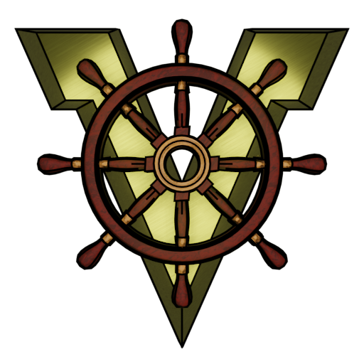

Hello everbody who reads this repo, here will be tips for playing minecraft with this unique and (!!!) stable mod

There is also ready to play package in releases for guys whot dont wants to find all these last versions of each part of mod on curseforge.

-If youre using industrialcraft2, youll encounter disappearing wires if you go over your render distance from ship or crash if your ship is disassembled. To fix it, go to mod settings, find valkyrien skies core, click on config, then on ship loading settings, then turn ON permanently loaded. This bug happens because VS has ship loading-unloading system, its main purpose is make VS playable on big servers with thousands of ships, but for some reason conflicts with industrialcraft2 and it corrputs wires on ships while unloading and kinda useless on small servers/local worlds.

-SoundPhysics mod also breaks ships in this world, use SoundFilters instead.

-Rudders aren't working, its not a bug and there isnt some stable solution to make they work, so use two propellers instead of one 
and yes, two speed controllers for each propeller too, left for left and right for right, its not hard 

-If your building isnt symmetrical, try to put these stabilizer blocks on perimeters of ship  but its not 100% solution and your ship will be little tilted anyway, so dont forget to place trapdoors with ladders if youre using it to not stuck if your ship tilts too much 

-If youre playing it in multiplayer and youre client, youll fall from ship if you was on it when last disconnecting because ship becomes passable through when your player entity enters the world but you still see loading screen and when all is loaded youll see death screen :/, so put all your goods in chest before disconnecting and place spawnpoint bed in ship to spawn on it. Or use keepinventory rule instead of.

-If youre playing multiplayer and disconnected from the game on ship and ship has changed its position, youll spawn in air, not on ship cause player positions written using always absolute minecraft coordinates (hello captain obvious)

-If youre encountering server-side lags (when there is less than a second lag that feels even if youre server) and your ship is moving your collision can "slide" into blocks of ship and youll be throw out of ship. This bug is VERY rare, but it can happen, ive encountered it for like a two times for two months of playing

-Item frames arent placable and working on ships, if youll assemble ship with item frames, theyll just drop out

-If youre playing with shaders with motion blur (SEUS Renewed for example) shader can add this blur on your ship when it moves, so turn motion blur off in shader settings

-Dont forget to have fun when playing

BELOW IS JUST VALKYRIEN SKIES DEFAULT READNE
# alkyrien Skies

See: [LICENSE file](https://github.com/ValkyrienSkies/Valkyrien-Skies/blob/master/LICENSE), [Project Roadmap](https://github.com/ValkyrienSkies/Valkyrien-Skies/wiki/Roadmap)

The Airships Mod to end all other Airships Mods. Better compatibility, performance, collisions, interactions and physics than anything prior!

## Installation

### Downloading
Official and stable releases of the Valkyrien Skies mod can be found on the [CurseForge page](https://www.curseforge.com/minecraft/mc-mods/valkyrien-skies).

Beta releases (warning: may be unstable!) can be found on the following:
- [CircleCI](https://circleci.com/gh/ValkyrienSkies/Valkyrien-Skies/tree/master) (click on the latest build #, then artifacts, then download the mod `.jar` file)
- [Jenkins](https://jenkins.daporkchop.net/job/Minecraft/job/ValkyrienSkies/) (click on the branch name, then download the mod `.jar` file)

### Installing on your server
To install Valkyrien Skies, move the downloaded `.jar` file into your Minecraft's `mods/` folder, just as you would any other mod.

## Wiki

Lots of information, including tutorials, can be found [on the Wiki](https://wiki.valkyrienskies.org).
Everything there is for the latest version, for old 0.9 builds see below.

## Development

*You may also be interested in the wiki page on development, which contains detailed instructions, FAQs, and more. https://wiki.valkyrienskies.org/wiki/Dev:Main_Page*

### Eclipse
1. Clone the repo: `git clone --recurse-submodules https://github.com/ValkyrienSkies/Valkyrien-Skies`
2. Copy in the `eclipse/` folder from a fresh installation of the [Forge MDK](http://files.minecraftforge.net)
3. Run `./gradlew setupDecompWorkspace eclipse`
4. Open the project in Eclipse
5. (Optional) recommend `git config submodule.recurse true`

### IntelliJ
1.  Clone the repo: `git clone --recurse-submodules https://github.com/ValkyrienSkies/Valkyrien-Skies`
2. Run `./gradlew setupDecompWorkspace idea genIntellijRuns`
3. Open the project in IntelliJ
4. Import the gradle project, sync gradle
5. Open settings (Control + Alt + S), and search for `Annotation Processors`
6. Check the `Enable annotation processing box`, and add `lombok.launch.AnnotationProcessorHider$AnnotationProcessor` to the list of Processor FQ Names
5. (Optional) recommend `git config submodule.recurse true`

